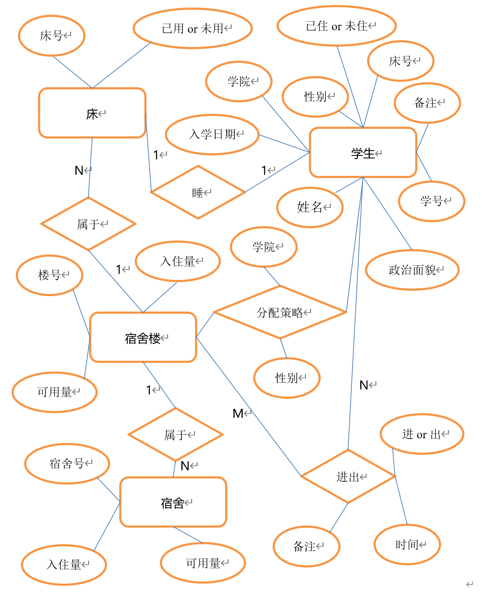
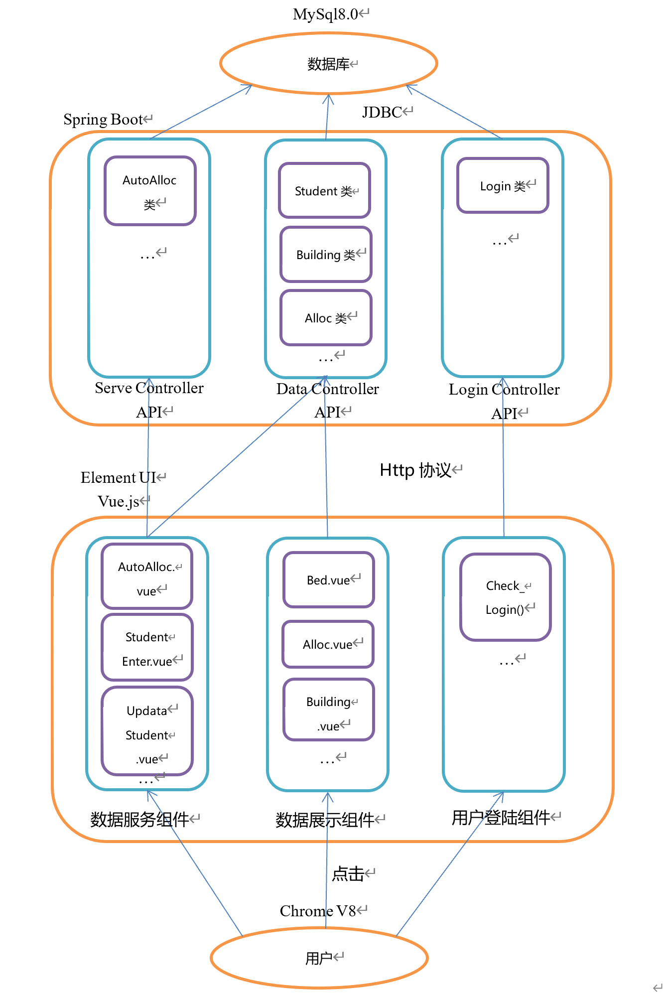

# dormitory-manager-system-api

## 前言

### 这可能是我读大学最后一个认真做的课程设计 

学生宿舍管理系统后端程序        
完成于
### 2020.2.10

## 目录
* [前言](#前言)
* [概述](#概述)
    * [系统需求](#系统需求)
        * [基本需求](#基本需求)
        * [扩展需求](#扩展需求)
    * [开发环境](#开发环境)
    * [基本原理或技术](#基本原理或技术)
    * [实现功能](#实现功能)
        * [基本功能](#基本功能)
        * [扩展功能](#扩展功能)
        * [未实现功能](#未实现功能)
* [数据库概念结构](#数据库概念结构)
    * [E—R图](#E—R图)
* [程序概要设计](#程序概要设计)
    * [程序架构](#程序架构)
* [程序详细设计](#程序详细设计)
    * [表结构Sql摘录](#表结构Sql摘录)
    * [引入重要库](#引入重要库)
    * [Http接口摘录](#Http接口摘录)
    * [JSON结构摘录](#JSON结构摘录)
* [总结](#总结)
    * [优点](#优点)
    * [不足](#不足)
    * [困难](#困难)
    * [收获](#收获)
    * [结语](#结语)
* [参考文献](#参考文献)
* [软件截图](#软件截图)

## 概述

### 系统需求

#### 基本需求

* 寝室分配：根据院系、年级分配寝室
- 学生管理：实现入住学生信息的登记、维护和查询功能
* 信息查询：按公寓楼号、学生姓名等查询住宿信息

#### 扩展需求

* 出入登记：对学生进出公寓的情况进行登记、实现基本的出、入监控功能

### 开发环境

* os：Windows 10  
- IDE：IntelliJ IDEA 2019.2
* Spring boot 2.2.3 release
- JDK：1.8

### 基本原理或技术

* Spring boot
- JDBC
* MySql8.0

### 实现功能

#### 基本功能

* 寝室分配
- 学生管理
* 信息查询

#### 扩展功能

* 出入登记
- 前后端分离
* 具有简洁友好的用户界面
- 具有区分特权用户和普通用户的功能

#### 未实现功能

* 没有给每个表都做全增删查改的功能

## 数据库概念结构

### E—R图

## 程序概要设计

### 程序架构

## 程序详细设计

### 表结构Sql摘录

#### 学生表

    create table student
    (
      count int auto_increment,
      studentID varchar(45) null,
      college varchar(45) null,
      bedID varchar(45) null,
      name varchar(45) null,
      date1 varchar(45) null,
      date2 varchar(45) null,
      live boolean null,
      politics varchar(45) null,
      sex varchar(45) null,
      `desc` varchar(300) null,
      constraint student_pk
        primary key (count)
    );
    
每个入学的学生对应产生表的一条记录。
    
#### 床表

    create table bed
    (
      count int auto_increment,
      bedID varchar(45) null,
      buildingID varchar(45) null,
      can boolean null,
      constraint bed_pk
        primary key (count)
    );

学校的每张床对应表的一条记录

### 引入库

#### JDBC操作库

    import java.sql.*;
    
#### 编码JSON库

    import java.util.Map;
    import java.util.LinkedHashMap;
    import org.json.JSONObject;
    import org.json.JSONArray;

#### Http接收和响应库

    import org.springframework.web.bind.annotation.RestController;
    import org.springframework.web.bind.annotation.PostMapping;
    import org.springframework.web.bind.annotation.RequestBody;
    

    
        

## 总结

### 优点

* 运用了课堂上没有教授的多线程技术

### 不足

* 登录系统是用客户端实现的，后端系统没有实现维护登陆态功能，通过截获前端的api，可以在没有用特权用户账号登陆的情况下使用特权账号的功能

### 困难

* 一开始没用前端框架直接写html发现代码量巨大而且写出来的界面单调简单
- 第一次尝试通过组件化工具套件设计UI界面
* 一开始直接在数据库用字符串类型存储日期信息，导致时区信息紊乱，并且需要编写很多专门处理包含日期信息的字符串的代码

### 收获

* 用timestamp技术来存储时间信息而非直接存储日期字符串
- 用element UI和vue.js前端框架可以省去很多重复性代码并且能快速编写出漂亮的用户界面

### 结语

第一次体验到全栈工程师的工作，从数据库结构到后端程序再到前端页面全是由自己一个人独立完成。
 
## 参考文献

* CSDN

## 软件截图
